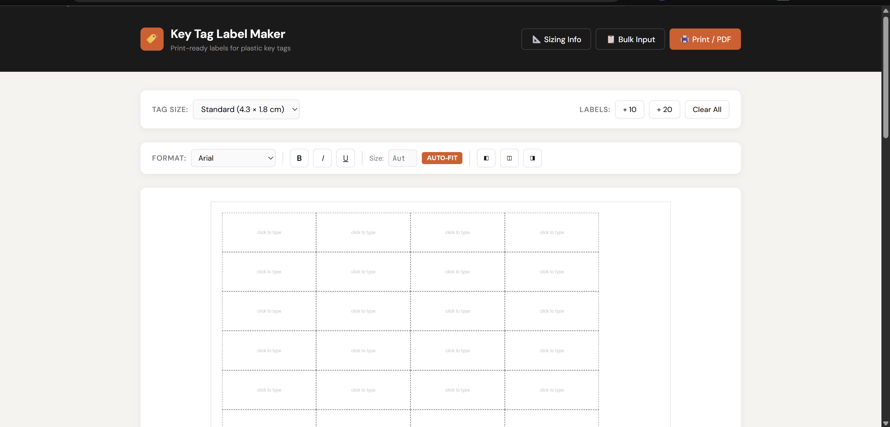
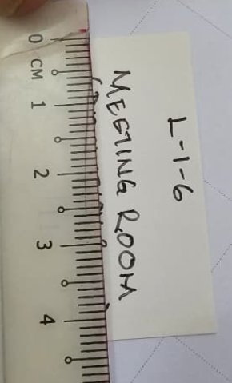
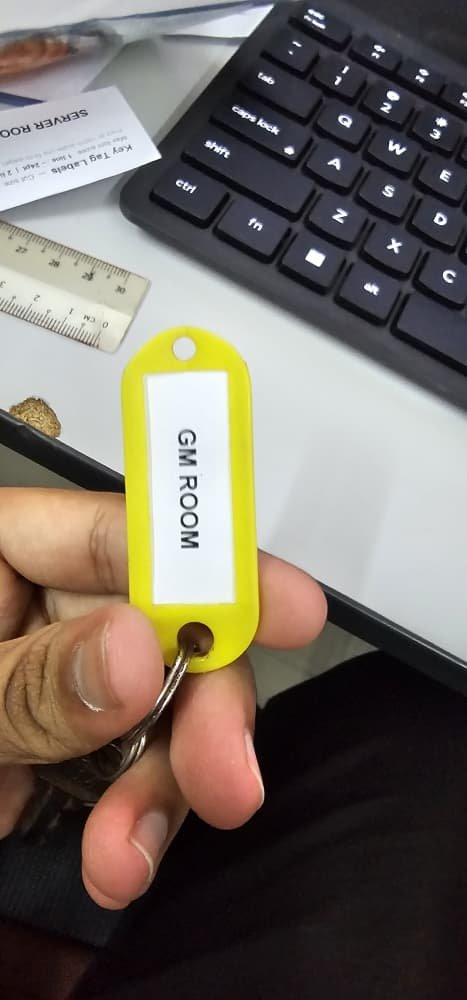

# 🏷️ Keytag Label Maker

> A free, browser-based tool to create **print-ready paper inserts** for plastic key identification tags. Type your labels, print at 100% scale, cut along the guides, and slide them in.

**[🔗 Try it live →](https://yourusername.github.io/keytag-label-maker/)**


<!-- 👆 TODO: Add a screenshot of the web app in action -->

---

## 🔑 What are these key tags?

These are the **colored plastic key tags** (also called key fobs, key ID tags, or key labels) commonly used by hotels, offices, building management, and facility teams to organize and identify keys.

| | |
|---|---|
|  |  |
| *Available in many colors — red, blue, green, yellow, black, etc.* | *Each tag has a transparent window to slide in a paper label* |

### The Problem

Writing labels by hand is messy and inconsistent. Ordering custom printed inserts is slow and expensive for small batches. This tool lets you **type and print professional labels in seconds**.

| Before (handwritten) | After (printed) |
|---|---|
|  |  |

<!-- 👆 TODO: Replace with your own before/after photos:
  - images/before-handwritten.jpg  → Photo of a handwritten key tag label
  - images/after-printed.jpg       → Photo of a printed key tag label (like your GM ROOM one)
-->

---

## ✨ Features

- **🔤 Auto-fit text** — Font size dynamically shrinks to fit the label box
- **📄 A4 print-ready** — Designed for A4 paper at 100% scale
- **📏 Multiple tag sizes** — Standard, small, and large presets + custom dimensions
- **📋 Bulk input** — Paste a list to create many labels at once
- **✂️ Cut guides** — Dashed borders for easy cutting
- **📦 Zero dependencies** — Single HTML file, no install needed
- **🌐 Works offline** — Download and open in any browser
- **🆓 Free & open source** — MIT licensed

---

## 📐 Key Tag Sizing Reference

> **Measure your own tags first!** Sizes vary between manufacturers. The dimensions below are based on the most common tags available on Amazon/Shopee/AliExpress.

### Standard Tag (Most Common)


```
        ┌─────────────────────────────────────┐
        │  ○                                  │
        │  ┌───────────────────────────────┐  │
        │  │                               │  │ 1.4 cm
  5.0cm │  │      YOUR LABEL HERE          │  │ (visible window height)
        │  │                               │  │
        │  └───────────────────────────────┘  │
        │           2.8 cm (window)    ○      │
        └─────────────────────────────────────┘
                      2.2 cm (body width)

  Paper insert size: 4.3 cm × 1.8 cm  ← this is what you cut & slide in
```

| Measurement | Value |
|:---|:---|
| Tag body (overall) | 5.0 × 2.2 cm |
| Visible window | 2.8 × 1.4 cm |
| **Paper insert (cut size)** | **4.3 × 1.8 cm** |
| Key ring hole | ∅ 6–7 mm |
| Split ring diameter | ∅ 1.7 cm |
| Material | PP or PE plastic |

### Other Common Sizes

| Tag Type | Tag Body | Window | Paper Insert |
|:---|:---|:---|:---|
| **Small** | 4.8 × 2.2 cm | 2.9 × 1.4 cm | 3.0 × 1.9 cm |
| **Standard** | 5.0 × 2.2 cm | 2.8 × 1.4 cm | **4.3 × 1.8 cm** |
| **Large** | 6.4 × 2.8 cm | 3.6 × 1.8 cm | 5.0 × 2.2 cm |

### How to Measure Your Tags

If your tags don't match these sizes, measure the **paper insert** that came inside the tag:


1. Remove the existing paper from inside the tag
2. Measure the **width** (longer side) in cm
3. Measure the **height** (shorter side) in cm
4. Enter these as a custom size in the app

---

## 🖨️ How to Use

### Step 1: Type Your Labels

Open the app and click on any box to type. Text auto-sizes to fit.

Use **Bulk Input** to paste many labels at once:
```
GM ROOM
SERVER ROOM / L1-3
MEETING ROOM | B-13
CANTEEN (1)
FIRE PANEL
```

Use `/` or `|` to add a second line within a label.

### Step 2: Print

1. Click **🖨️ Print / PDF**
2. Set paper size to **A4**
3. ⚠️ Set scale to **100%** (do NOT use "Fit to page")
4. Set margins to **Minimum** or **None**
5. Print directly or **Save as PDF**

### Step 3: Cut & Insert


<!-- 👆 TODO: Add a photo showing cutting the labels and sliding into the tag -->

1. Cut along the dashed lines
2. Slide the paper strip into the tag slot
3. The transparent film holds it in place

### Result


<!-- 👆 TODO: Add your photo of the finished key tag on a key (like the GM ROOM photo) -->

---

## 🚀 Deploy to GitHub Pages

1. **Fork** this repository (or click "Use this template")
2. Go to **Settings → Pages**
3. Set source to **Deploy from a branch** → `main` → `/ (root)`
4. Wait ~1 minute, your site will be live at:
   ```
   https://yourusername.github.io/keytag-label-maker/
   ```

### Run Locally

No build tools needed. Just open the file:

```bash
# Clone
git clone https://github.com/yourusername/keytag-label-maker.git

# Open (macOS)
open keytag-label-maker/index.html

# Open (Linux)
xdg-open keytag-label-maker/index.html

# Open (Windows)
start keytag-label-maker/index.html
```

---

## 📁 Project Structure

```
keytag-label-maker/
├── index.html          ← The entire app (single file, no build step)
├── README.md           ← You're reading this
├── LICENSE             ← MIT license
└── images/             ← Reference photos
    ├── screenshot.png
    ├── keytag-colors.jpg
    ├── keytag-on-key.jpg
    ├── keytag-dimensions.jpg
    ├── keytag-measured.jpg
    ├── before-handwritten.jpg
    ├── after-printed.jpg
    ├── cut-and-insert.jpg
    └── final-result.jpg
```

---

## 🤝 Contributing

Contributions are welcome! Some ideas:

- [ ] Save/load label sets to browser storage
- [ ] Additional tag size presets from different manufacturers
- [ ] QR code or barcode support
- [ ] Color-coded label backgrounds
- [ ] Multi-page support for large batches
- [ ] CSV import/export
- [ ] Multi-language UI

---

## 📸 Image Checklist

Before publishing, add your own photos to the `images/` folder. Here's what to capture:

| File | What to Photograph |
|:---|:---|
| `screenshot.png` | Screenshot of the web app with some labels filled in |
| `keytag-colors.jpg` | A pile or fan of different colored key tags |
| `keytag-on-key.jpg` | A labeled key tag attached to a real key |
| `keytag-dimensions.jpg` | Tag next to a ruler showing measurements |
| `keytag-measured.jpg` | Paper insert being measured with a ruler |
| `before-handwritten.jpg` | A messy handwritten label in a tag |
| `after-printed.jpg` | A clean printed label in a tag |
| `cut-and-insert.jpg` | Labels being cut from the printed sheet |
| `final-result.jpg` | The finished product — labeled tag on a keyring |

> 💡 **Tip:** You already have most of these photos from your testing! Just rename and drop them in.

---

## 📄 License

MIT License — free for personal and commercial use. See [LICENSE](LICENSE).

---

<p align="center">
  Made for building engineers, facility managers, and anyone who manages keys 🔑<br>
  <sub>If this saved you time, give it a ⭐</sub>
</p>
